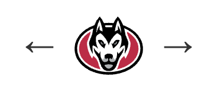

# Join or contribute to the SCSU Webring

The SCSU Webring connects personal websites created by people who are part of the St. Cloud State University. You can join if you
are:

- Currently an SCSU student.
- An SCSU graduate or former student.

Your site should have a publicly accessible URL and should be a personal,
portfolio, project, blog, or other site that you are allowed to modify. You
must be able to add the webring navigation and the shared `webring.js` script
to your site.

## How the ring works

The ring follows the order of members in the `members` array in
[`webring.js`](./webring.js). Each member has a Previous link and a Next link.
The first and last entries connect to each other, creating a continuous loop.

To join, you must complete both parts:

1. Add your member information to the bottom of the `members` array in
   [`webring.js`](./webring.js).
2. Add the navigation and the shared `webring.js` script to your personal
   website.

Adding your information without installing the navigation will leave the ring
incomplete, so test both parts before opening a pull request.

## Step 1: Fork the repository

1. Open the [SCSU Webring repository](https://github.com/iordjn/scsu-webring).
2. Select **Fork** in the upper-right corner of the GitHub page.
3. Create the fork under your own GitHub account.
4. Clone your fork, or open it in GitHub Codespaces or another editor.

If you clone the fork locally, use:

```bash
git clone https://github.com/iordjn/scsu-webring.git
cd scsu-webring
```


## Step 2: Add your member information

Open [`webring.js`](./webring.js), find the `members` array near the top, and
add your entry to the **bottom of the list**:

```js
{
  name: "Your Name",
  year: 2026,
  major: "Your Major",
  url: "https://your-site.example"
}
```

Use these values:

- `name`: The name you want displayed in the public member directory.
- `year`: Your graduation year, expected graduation year, or another
  appropriate SCSU year.
- `major`: Your SCSU major, program, or area of study.
- `url`: The exact public URL where you installed the webring navigation.

Keep the existing formatting, add a comma after the previous member, and make
sure your URL is unique. The `url` value must match your site's
`data-site-url` value.

## Step 3: Add the navigation to your website


Add this navigation wherever you want the ring to appear. Replace
`https://your-site.example` with your site's exact URL:

```html
<nav
  class="webring-nav"
  data-site-url="https://your-site.example"
  aria-label="Webring navigation"
>
  <a
    data-direction="previous"
    href="#"
    aria-label="Previous webring site"
  >
    &larr;
  </a>

  <a
    href="https://iordjn.github.io/scsu-webring/"
    aria-label="Visit the SCSU Webring"
  >
    
  </a>

  <a
    data-direction="next"
    href="#"
    aria-label="Next webring site"
  >
    &rarr;
  </a>
</nav>

<script src="https://iordjn.github.io/scsu-webring/webring.js"></script>
```

The `data-direction="previous"` and `data-direction="next"` attributes are
required. The logo is an image link to the hub, so selecting it always opens
the SCSU Webring homepage. The `data-site-url` value must match your member
entry, including the correct domain and path.

## Step 4: Add the shared script

The navigation will not work unless your personal website also loads the
shared script:

```html
<script src="https://iordjn.github.io/scsu-webring/webring.js"></script>
```

The script reads the member list, identifies your site, and fills in the
Previous and Next URLs. Do not use only the SVG or static arrows without
loading the script.

## Step 5: Test your site

Before submitting your change, verify that:

1. Your website is publicly accessible.
2. The navigation appears on the page.
3. The shared `webring.js` script loads successfully.
4. Previous opens the member immediately before your entry.
5. Next opens the member immediately after your entry.
6. Your entry is at the bottom of the `members` array.
7. Your `data-site-url` matches your `url` value.
8. The browser console has no JavaScript errors.

Because `webring.js` contains the member list directly and does not fetch a
separate data file, you can open [`index.html`](./index.html) directly in a
browser to test the hub. You may still use a local static server if your
browser or editor prefers one.

## Step 6: Commit and open a pull request

From your fork, review your changes and create a branch:

```bash
git checkout -b add-your-name
git add webring.js
git commit -m "Add Your Name to the SCSU Webring"
git push origin add-your-name
```

Then open a pull request from your fork's branch to the `main` branch of the
SCSU Webring repository.

Your pull request should include:

- Your new member entry at the bottom of `webring.js`.
- The public URL where the navigation and script are installed.
- A short confirmation that you are currently or formerly part of SCSU.
- Any relevant styling or accessibility details.

Keep the pull request focused on your membership entry and the navigation
installation. A maintainer may ask you to correct the URL, formatting, or
navigation before merging.

## Contributing improvements

You can also contribute improvements to the hub, shared script, styles, or
documentation. For changes beyond adding yourself to the ring:

1. Fork the repository and create a focused branch.
2. Make the smallest related change.
3. Test the hub and any affected navigation behavior.
4. Explain what changed and how you tested it in the pull request.

Do not remove or reorder existing members when adding yourself. Append new
members to the bottom unless a maintainer asks for a different ordering.

## Troubleshooting

### The arrows do nothing

Confirm that your page includes both direction attributes and the shared
script:

```html
data-direction="previous"
data-direction="next"
<script src="https://iordjn.github.io/scsu-webring/webring.js"></script>
```

### The navigation is disabled

Your site is probably not being found in the member list. Check that your
entry is present in `webring.js` and that `data-site-url` matches your `url`,
including the protocol, hostname, path, and trailing slash.

### The site is not listed in the directory

Make sure your entry was added to the `members` array in `webring.js`, not to
the README or a separate file. The current project stores the member list
directly in that script.
