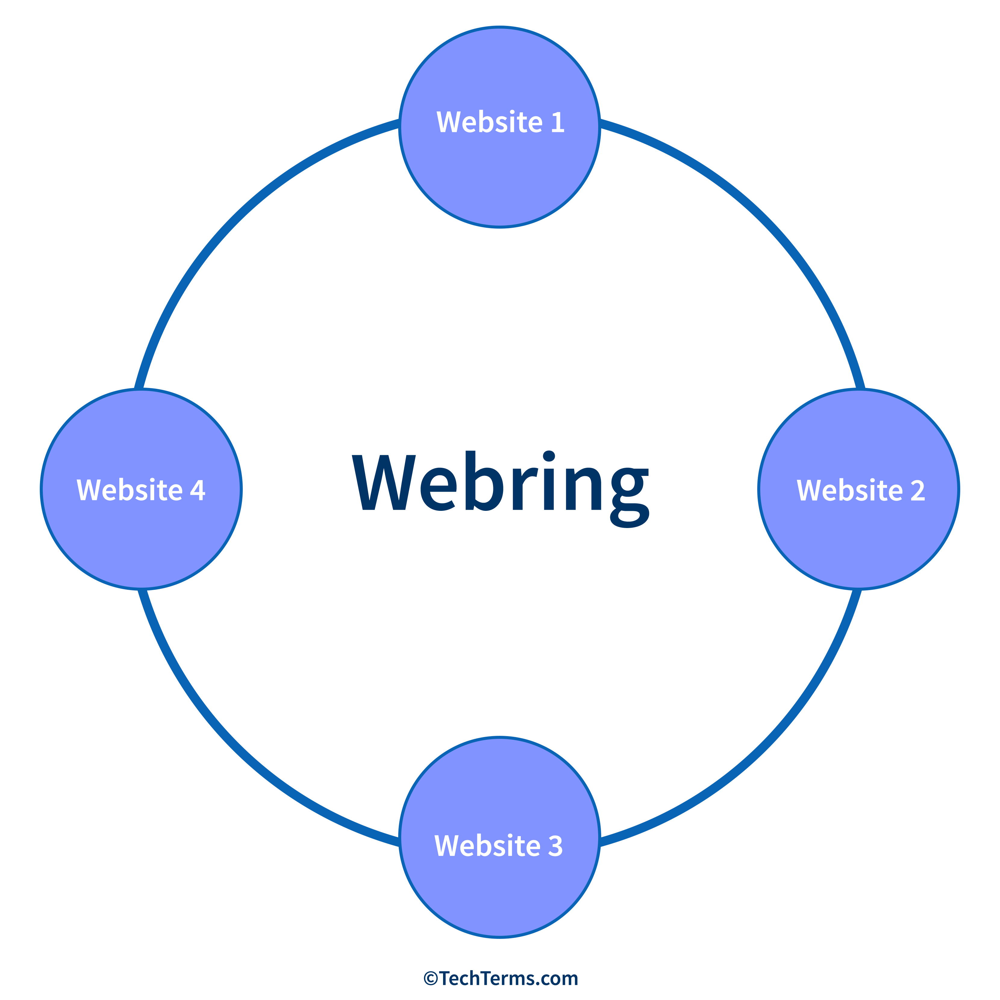

# SCSU Webring

The SCSU Webring is a shared navigation ring for websites created or
maintained by St. Cloud State University students and alumni. Visitors can
follow the ring from one member website to the next using Previous and Next
links.

The ring is circular:



## How it works

This repository contains:

- [`index.html`](./index.html), the public webring hub and member directory.
- [`webring.js`](./webring.js), the shared navigation logic and member list.
- [`Contributing.md`](./Contributing.md), instructions for joining and
  contributing.

When `webring.js` loads on a site, it:

1. Finds the site's `.webring-nav` navigation element.
2. Reads the member list defined in the script.
3. Identifies the current site using `data-site-url`, or the current page URL
   when that attribute is not provided.
4. Finds the member immediately before and after the current site.
5. Updates the Previous and Next links with those members' URLs.

The first and last members connect to each other, so the ring never ends. The
hub page is not a member; it uses `data-hub="true"` to link to the last and
first members.

## Join the ring

Read [`Contributing.md`](./Contributing.md) for eligibility requirements,
forking instructions, member entry format, navigation options, testing, and
pull request steps.

## Add the navigation

Add the navigation to your site and replace the `data-site-url` value with the
exact URL used for your member entry:

```html
<nav
  class="webring-nav"
  data-site-url="https://example.com/your-site"
  aria-label="Webring navigation"
>
  <a
    data-direction="previous"
    href="#"
    aria-label="Previous webring site"
  >
    &larr;
  </a>

  <a
    data-direction="next"
    href="#"
    aria-label="Next webring site"
  >
    &rarr;
  </a>
</nav>

<script src="https://iordjn.github.io/scsu-webring/webring.js"></script>
```

Both direction links and the shared script are required for the navigation to
work. The member list is maintained in the `members` array near the top of
[`webring.js`](./webring.js); contribution details are documented in
[`Contributing.md`](./Contributing.md).

## Local development

The script does not fetch a separate data file, so the hub can be opened
directly from the filesystem. Open [`index.html`](./index.html) in a browser,
or use any local static server if your browser or editor prefers one.

## Limitations

The ring is client-side. Every member site must load `webring.js`, and every
member must be included in its `members` array. The project does not currently
provide server-side `/next`, `/previous`, or `/random` redirect endpoints.
